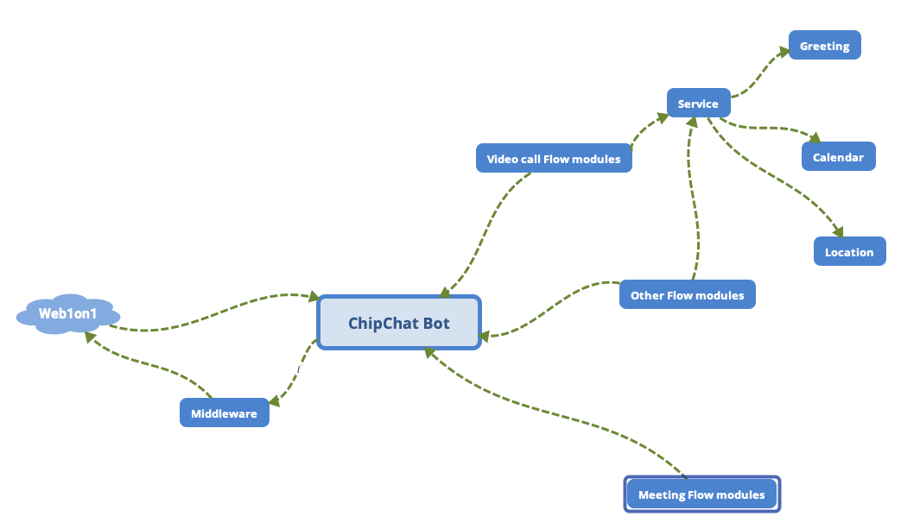

Web1on1 Coding Challenge
===================
This is a simple framework to create a converstion flow for ChipChat module.
## How it works
### Requiements
Developement
* Node 12
* ngrok  

Production  
* Docker 

### How to run
development  
update token in ./config/default.json
```
yarn global add ngrok
yarn
yarn dev
ngrok http 3000
```
production
```
docker build . -t web1on1
docker run -p 3000:3000 -e API_TOKEN=########################################### web1on1
```

### Test
All the functions have unit test.
```
yarn test
```

### What to expect
Bot will  
* greet you
* ask about meeting subject
* ask about custom meeting subject
* open a webview the in future become a calendar to choose date time

### Structure
For defining new flow we have to extend Flow class
each flow has steps and each step has:
* filter
* function
* meta, options  
  
**Structure of the Framework**  

----------

# Post-challenge questions

When submitting your code, please answer the following questions by email:

1. What frictions did you experience when using the onboarding bot, our API documentation and SDK?  
```Documentation was so comprehensive most important issue that I faced was, I got lost in documents there was to many resources to check but the implementation guide on node was so helpful```
2. How long did you spend on the coding test? What would you add to your solution if you had more time? If you didn't spend much time on the coding test then use this as an opportunity to explain what you would add.  
```My estimation was 5.5 hours but I missed some tasks such as setting up linter or writing docker or managing config file but these tasks didn't take so much time```
3. What was the most useful or surprising feature that you discovered in our product offering?  
```There was a lot of flexibility I really liked the design and the way that you handled the challenge I didn't have any issue on accessing any resources```
4. How would you track down a performance issue of your bot in production? Have you ever had to do this?  
```Most important part is communication and I think maybe because of some reasons(packet drop or ...) we face some missing message or wrong responses```
5. How would you improve the Web1on1 APIs that you just used?  
```1) Mostly on organizing the documentation based on developers need 2) Creating a sandbox```
# Future improvements
* Ability of choosing dates
* Working with Web1on1 locations
* Creating reusable function for services
* Developing e2e tests
* Testing performance on high load
* Developing health check
* Implementing logging system
* Configuring CI/CD
----------

#### Thanks for Amazing challenge I hope to hear from you soon

Ehsan Mirzarazi

